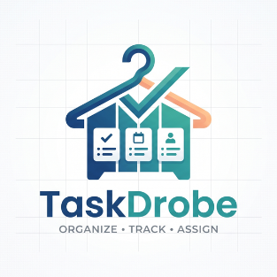

<div align="center">
  
  <h1>🚀 TaskDrobe</h1>
  <p><strong>Enterprise-Grade Project, Team, and Workspace Management Platform</strong></p>

  <p>
    
    
    
    
    
    
  </p>
</div>

---

## 📖 Overview

**TaskDrobe** is a full-stack, real-time collaborative workspace and project management system built with **Node.js**, **Express**, **PostgreSQL**, **Redis**, **Socket.IO**, and **EJS**. 

Designed with a strict **Role-Based Access Control (RBAC)** architecture, TaskDrobe provides tailored workspaces for **Admins (God Mode)**, **Managers**, and **Employees**. It combines project and task lifecycle tracking, conflict-free team meeting scheduling, threaded discussions, real-time WebSocket chat and notifications, automated cron reminders, tiered rate-limiting, and a hybrid Redis/RAM query caching engine.

---

## ✨ Key Features

### 🔐 1. Role-Based Workspaces (RBAC)
* **Admin ("God Mode"):**
  * Global system statistics (total, active, and inactive users, plus top 5 busiest employees workload analytics).
  * Complete user lifecycle management (`views/admin/users.ejs`), cross-organization team insights (`views/admin/teams.ejs`), and global activity audit logs (`views/admin/activities.ejs`).
  * **Global Meeting Audit Log (`/admin/meetings`):** Filter all past, live, and upcoming meetings across the organization by creator or date, with administrative force-delete capabilities.
* **Manager Workspace:**
  * Dedicated Manager Dashboard (`man_dashboard.ejs`) featuring team overviews, deadline trackers, attention alerts, and project/task analytics charts.
  * End-to-end creation and management of Teams, Projects, Project Members, and Task assignments.
* **Employee Workspace:**
  * Personalized Employee Dashboard (`emp_dashboard.ejs`) with interactive task completion charts, project carousels, quick-access sticky notes (`recentNotesWidget.ejs`), and a live schedule widget (`scheduleWidget.ejs`).
  * Task status transitions, file attachments, and task-level insights (`task-insight.ejs`).

### 📅 2. Smart Meeting Scheduler & Overlap Prevention
* **Conflict Detection:** Automatically validates team schedules at the database level (`MeetingModel.checkOverlap`) to prevent overlapping time slots (`HTTP 409 Conflict`).
* **Live Status Badges:** Dynamic state tracking (`LIVE NOW`, `UPCOMING`, `COMPLETED`) with direct meeting join links.
* **Automated Cron Alerts:** Background `CronService` dispatches real-time Socket.IO alerts and persistent notifications prior to scheduled meetings and task deadlines.

### 💬 3. Real-Time Collaboration & Communication
* **Global & Direct Chat (`chatSocketController.js`):** Instant messaging powered by Socket.IO with persistent conversation and message history in PostgreSQL.
* **Live Notifications (`notificationSocketController.js`):** Real-time toast alerts and unread badge counters for task assignments, comments, and scheduled meetings.
* **Threaded Discussions (`commentModel.js`):** Project-level and task-level comment threads supporting nested replies (`reply_to_id`), user avatars, and instant cache invalidation.
* **Personal Sticky Notes (`noteController.js`):** Rich personal scratchpad for quick reminders and workspace notes.

### ⚡ 4. Enterprise Performance, Security & Scalability
* **Hybrid Redis + In-Memory Caching (`cacheService.js`):**
  * Implements the **Cache-Aside Pattern** using `ioredis` with automatic CLI connection string parsing.
  * Gracefully falls back to a local Node.js `Map` with TTL expiration if Redis is unreachable, ensuring zero downtime.
  * Automatic prefix-based cache invalidation (`invalidatePrefix`) on `POST`, `PUT`, and `DELETE` operations.
* **Tiered Rate Limiting (`middleware/rateLimiter.js`):**
  * **Global Tier:** `300 req / 15 min` across dynamic routes (static assets bypassed).
  * **Auth Tier:** `10 failed attempts / 15 min` on `/auth` `POST` endpoints to block brute-force attacks.
  * **Mutation Tier:** `40 write requests / 1 min` across `POST`, `PUT`, `PATCH`, and `DELETE` endpoints.
  * **API & Search Tier:** `60 req / 1 min` for live navbar search (`#globalSearch`) and notification polling.
  * **Smart Identification:** Tracks authenticated users by `user_id` (preventing shared office Wi-Fi lockouts) and guests by IP, with automatic Admin bypass and dual JSON/HTML `429` error responses.
* **SQL & Connection Pool Optimization:**
  * Single-pass PostgreSQL aggregations using `COUNT(*) FILTER (WHERE ...)` CTEs.
  * Composite B-Tree indexing across `tasks`, `projects`, `team_members`, `meetings`, `comments`, and `notifications`.
  * Tuned `pg.Pool` (`max: 20`, `idleTimeoutMillis: 30000`, `connectionTimeoutMillis: 5000`).
* **HTTP Hardening & Graceful Shutdown:**
  * Gzip/Deflate payload compression (`compression`), `1MB` JSON/URL-encoded body limits, 1-day browser static asset caching (`etag` + `maxAge: '1d'`), and automated 15-minute PostgreSQL session pruning.
  * Clean `SIGINT` and `SIGTERM` shutdown hooks that close Socket.IO, active HTTP keep-alive connections, Redis, and the PostgreSQL connection pool without dropping in-flight operations.

---

## 🛠️ Tech Stack

| Layer | Technologies Used |
| :--- | :--- |
| **Backend Runtime & Framework** | Node.js, Express.js |
| **Database & Caching** | PostgreSQL (`pg`), Redis (`ioredis`) + In-Memory TTL Fallback |
| **Real-Time Engine & Jobs** | Socket.IO, Node-Cron (`cronService.js`) |
| **Authentication & Security** | Passport.js, Express-Session (`connect-pg-simple`), JWT (`utils/jwt.js`), `express-rate-limit` |
| **Frontend & Templating** | EJS (Server-Side Rendering), Custom CSS3, Vanilla JS, jQuery AJAX, SweetAlert2, Chart.js |
| **DevOps & Process Management** | PM2 (`ecosystem.config.js`), Compression, Dotenv |

---

## 📦 Complete Library Installation (Bash Shell)

You can install all project dependencies automatically via `npm install` (which reads `package.json`), or install every library manually in a new environment using the Bash script below:

### Option A: Standard Install from `package.json`
```bash


# 1. Core Server, Templating & Performance Middleware
npm install express@^5.2.1 ejs@^6.0.1 express-ejs-layouts@^2.5.1 compression@^1.8.2 dotenv@^17.4.2 cookie-parser@^1.4.7

# 2. Database Drivers, Session Store & Redis Caching
npm install pg@^8.22.0 postgres@^3.4.9 connect-pg-simple@^10.0.0 ioredis@^6.0.0 mongoose@^9.9.1

# 3. Authentication, Security & Rate Limiting
npm install passport@^0.7.0 passport-google-oauth20@^2.0.0 express-session@^1.19.0 jsonwebtoken@^9.0.3 bcrypt@^6.0.0 express-rate-limit@^8.7.0

# 4. Input Validation & File Uploads
npm install joi@^18.2.3 express-validator@^7.3.2 multer@^2.3.0

# 5. Real-Time WebSockets, Scheduled Cron Jobs & Email Dispatch
npm install socket.io@^4.8.3 node-cron@^4.6.0 nodemailer@^10.0.10

# 6. Utility & Development Packages
npm install nodemon@^3.1.14 path@^0.12.7 crypto@^1.0.1 fs@^0.0.1-security http@^0.0.1-security
```
---
## 📂 Project Architecture

```text
TaskDrobe/
├── 📁 config/
│   ├── 📄 environment.js               # Centralized environment variable loader
│   └── 📄 passport.js                  # Passport authentication strategies & serialization
├── 📁 controllers/
│   ├── 📄 activityController.js        # Workspace activity logs & feeds
│   ├── 📄 adminController.js           # Admin God-Mode users, teams & system metrics
│   ├── 📄 attachmentController.js      # Project & task file upload handlers
│   ├── 📄 authController.js            # Login, signup, logout & password reset flows
│   ├── 📄 chatController.js            # REST endpoints for conversation history
│   ├── 📄 chatSocketController.js      # Socket.IO real-time messaging handler
│   ├── 📄 dashboardController.js       # Role-specific dashboard aggregators
│   ├── 📄 meetingController.js         # Meeting scheduling, overlap checks & Admin audit log
│   ├── 📄 noteController.js            # Personal notes CRUD operations
│   ├── 📄 notificationController.js    # Notification read/unread state management
│   ├── 📄 notificationSocketController.js # Real-time Socket.IO notification broadcaster
│   ├── 📄 profileController.js         # User profile & avatar management
│   ├── 📄 projectController.js         # Project lifecycle & details management
│   ├── 📄 projectMemberController.js   # Project member assignment & removal
│   ├── 📄 searchController.js          # Global live search across workspace entities
│   ├── 📄 taskController.js            # Task CRUD, assignment, status & priority updates
│   └── 📄 teamController.js            # Team creation & membership controllers
├── 📁 database/
│   ├── 📁 modules/
│   │   ├── 📁 activities/              # 01_actiivities.sql, 02_notes.sql, 03_meetings.sql
│   │   ├── 📁 auth/                    # Roles, users, sessions, profiles, chat & notifications SQL
│   │   ├── 📁 projects/                # Project status, projects, members, attachments & comments SQL
│   │   ├── 📁 tasks/                   # Task status, priority & tasks schema SQL
│   │   └── 📁 teams/                   # Teams & team_members schema SQL
│   ├── 📝 README.md                    # Database module documentation
│   └── 📄 dbSetup.js                   # Automated SQL schema & seed runner script
├── 📁 logs/                            # PM2 out and error log files
├── 📁 middleware/
│   ├── 📄 authMiddleware.js            # Session & JWT authentication guard
│   ├── 📄 documentUploadMiddleware.js  # Multer configuration for project/task attachments
│   ├── 📄 errorHandler.js              # Centralized Express error handling middleware
│   ├── 📄 rateLimiter.js               # 4-tier express-rate-limit configuration
│   ├── 📄 roleMiddleware.js            # RBAC role verification guard (admin, manager, employee)
│   └── 📄 uploadMiddleware.js          # Profile avatar upload middleware
├── 📁 models/
│   ├── 📄 activityModel.js             # SQL queries for workspace activity streams
│   ├── 📄 attachmentModel.js           # SQL queries for uploaded documents
│   ├── 📄 chatModel.js                 # SQL queries for conversations & messages
│   ├── 📄 commentModel.js              # Cached project & task threaded comment queries
│   ├── 📄 dashboardModel.js            # Cached single-pass FILTER queries for stats & charts
│   ├── 📄 meetingModel.js              # Cached meeting queries, overlap checks & admin filters
│   ├── 📄 noteModel.js                 # SQL queries for user notes
│   ├── 📄 notificationModel.js         # SQL queries for user notifications & unread counts
│   ├── 📄 projectMemberModel.js        # SQL queries for project team allocations
│   ├── 📄 projectModel.js              # SQL queries for projects
│   ├── 📄 roleModel.js                 # SQL queries for RBAC roles
│   ├── 📄 taskModel.js                 # SQL queries for tasks, deadlines & workloads
│   ├── 📄 teamModel.js                 # SQL queries for teams & team members
│   └── 📄 userModel.js                 # SQL queries for users & user_profiles
├── 📁 plugins/
│   ├── 📄 db.js                        # Tuned PostgreSQL connection pool (pg.Pool)
│   └── 📄 query.js                     # Parameterized SQL execution wrapper
├── 📁 providers/
│   ├── 📄 routeConfig.js               # Declarative route definitions (public, protected, api, roles)
│   └── 📄 routeServiceProvider.js      # Centralized router mounting & middleware pipeline
├── 📁 public/
│   ├── 📁 css/                         # Modular stylesheets (style, dashboard, manager, emp, project, etc.)
│   ├── 📁 images/                      # Static brand assets (logo.png)
│   └── 📁 js/                          # Client-side AJAX & UI scripts (meetings, notes, tasks, navBar, etc.)
├── 📁 routes/                          # Express route modules mapped via RouteServiceProvider
├── 📁 services/
│   ├── 📄 activityService.js           # Business logic for activity logging
│   ├── 📄 adminService.js              # Business logic for administrative operations
│   ├── 📄 authService.js               # Authentication, hashing & token services
│   ├── 📄 cacheService.js              # Hybrid Redis + In-Memory RAM cache service
│   ├── 📄 commentService.js            # Discussion thread service layer
│   ├── 📄 cronService.js               # Background scheduled jobs & meeting reminders
│   ├── 📄 dashboardService.js          # Dashboard data aggregation service
│   ├── 📄 emailService.js              # Transactional email dispatch service
│   ├── 📄 projectMemberService.js      # Project member management logic
│   ├── 📄 projectService.js            # Project management business logic
│   ├── 📄 searchService.js             # Multi-entity workspace search service
│   ├── 📄 taskService.js               # Task lifecycle business logic
│   └── 📄 teamService.js               # Team management business logic
├── 📁 utils/
│   ├── 📄 AppError.js                  # Custom operational error class with HTTP status codes
│   ├── 📄 jwt.js                       # JWT signing and verification utilities
│   └── 📄 responseFormatter.js         # Standardized API JSON response helper
├── 📁 validators/                      # Request payload validation schemas & middleware
├── 📁 views/
│   ├── 📁 admin/                       # Admin views (dashboard, users, teams, team_insight, activities)
│   ├── 📁 layout/                      # Reusable EJS partials, modals, widgets, navbar & sidebar
│   ├── 📁 manager/                     # Manager views & dashboard partials
│   ├── 📁 teams/                       # Shared team listing & insight views
│   └── 📄 *.ejs                        # Core pages (emp_dashboard, meetings, adminMeetings, projects, tasks, etc.)
├── ⚙️ .gitignore
├── 📄 app.js                           # Application entry point, Socket.IO & graceful shutdown
├── 📄 ecosystem.config.js              # PM2 production process configuration
└── ⚙️ package.json